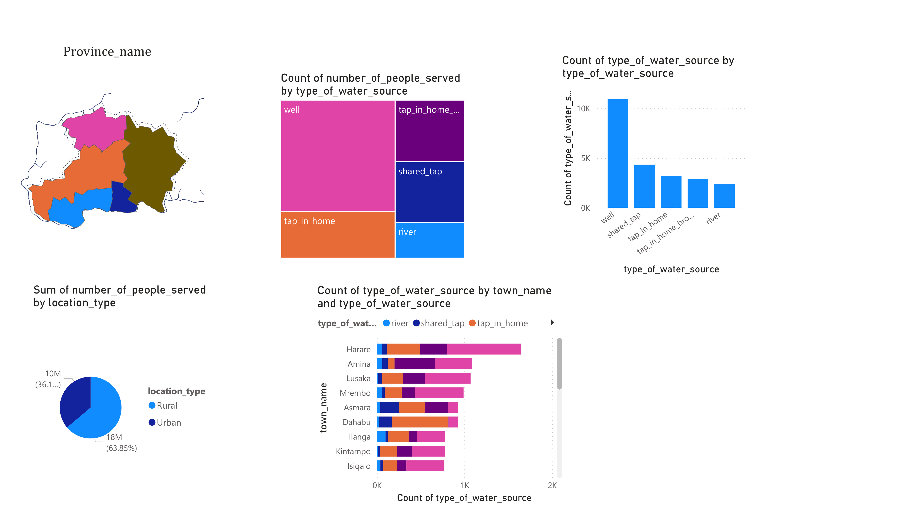
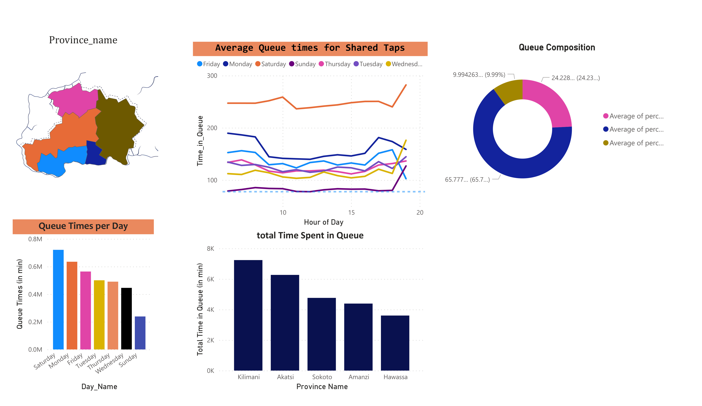

# Visuals-of-Maji-Ndogo-Water-Crisis-Project
This project illustrates the visual representations of water by national belts, time spent in queues, the water pollution status and crime related issues by province and victim gender
  
  # Project Overview 
  This project aimes to analyze the water crises in Maji Ndogo across different provinces acrross the country. It seeks to project the number of people served by the type of water sources, thus wells, taps,and rivers.It also predicts the count of the type of water sources by location type (rural and urban) and by province type. The analysis also will provide insights on the average queue times for shared taps and the total time spent in queue per hour or day, along side the pollutin components and the various types of crimes meted out based on victim gender. The project is motivated by the United Nations Sustainable Development Goal 6 that ensures the availability and sustainable management of water and sanitation for all.

  # Introduction 

  # Objectives
  - To evaluate the access to basic drinking water by exploring the various type of water sources and its provincial share
  - To explore the average time in queues by day and time of the week
  - To examine the pollution status of various water sources
  - To analyze the crime data related to accessing water by victim gender.

  # V

 

## KOFI

  # Visualisation Findings 
  